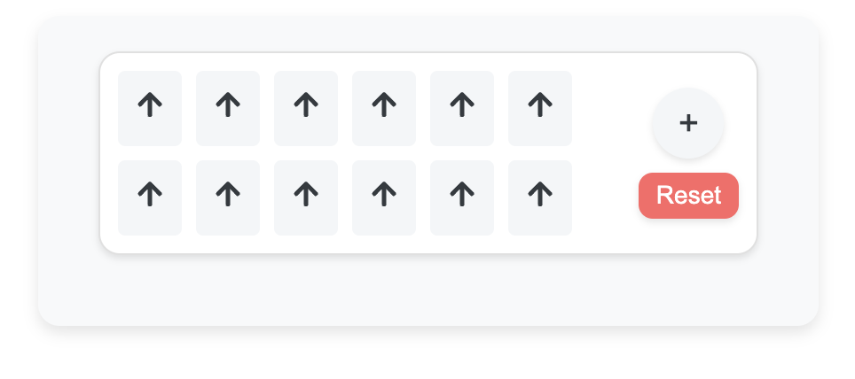
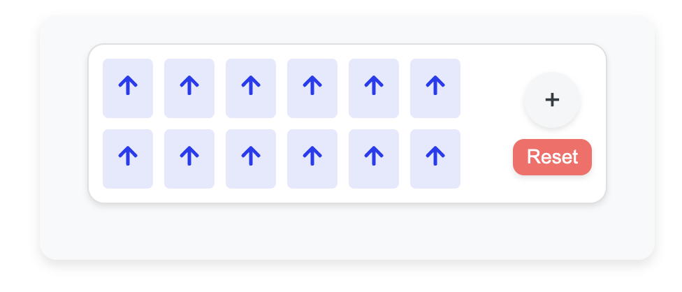

# Upvote List Application

> A simple and interactive React application for managing a list of upvotes, allowing you to toggle, add, and reset upvotes.




## 🚀 Features

- **Toggle Upvotes**: Click on any upvote to change the selection state of all upvotes in the list.
- **Add Upvotes**: Add new upvotes to the list with a single click.
- **Reset All Upvotes**: Quickly reset all upvotes to their initial state with the reset button.
- **State Persistence**: Keeps the upvote state even after refreshing the page using localStorage.

## 🌟 Technologies Used

- **React**: For building the user interface.
- **Styled-Components**: For styling components
- **React Icons**: For using vector icons.
- **React Testing Library**: For writing and running unit tests.

## 🛠️ Installation

Follow these steps to get the project up:

1. **Clone the repository**:

   ```bash
   git clone https://github.com/your-username/upvote-list.git
   cd upvote-list
   ```

2. **Install the dependencies**:

   ```bash
   npm install
   ```

3. **Run the development server**:

   ```bash
   npm start
   ```
